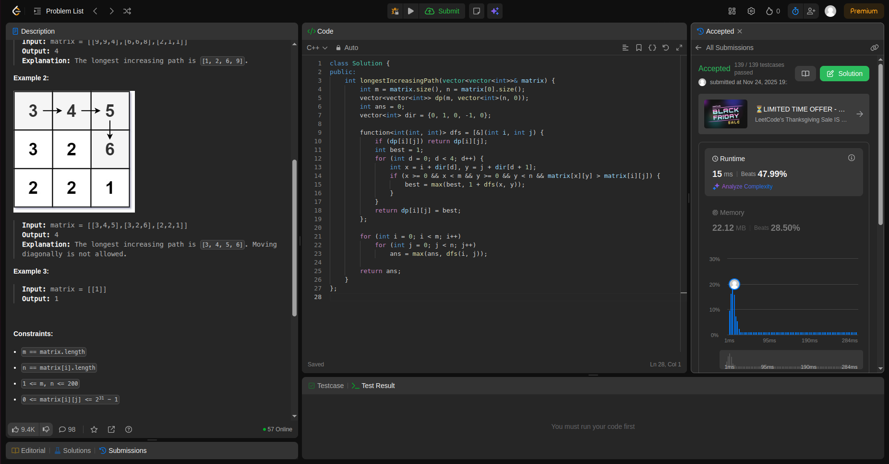
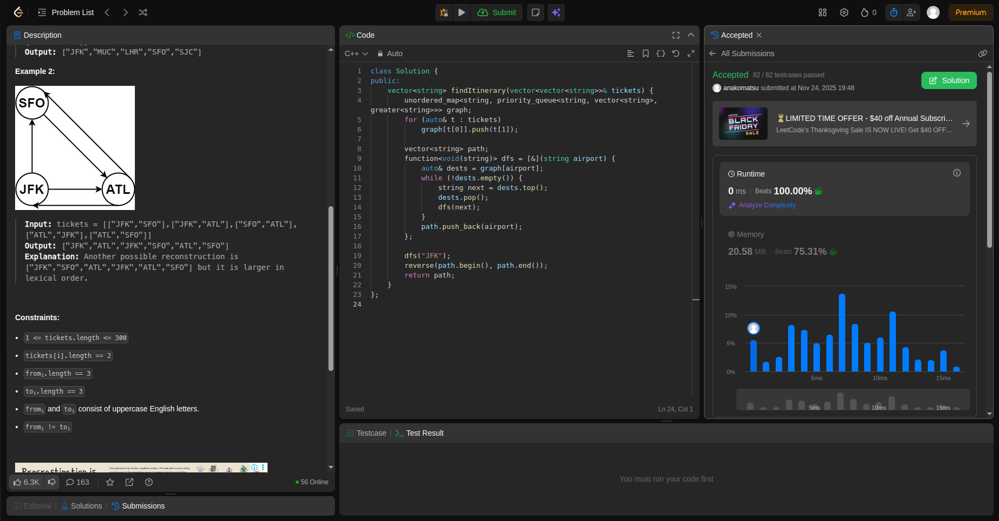
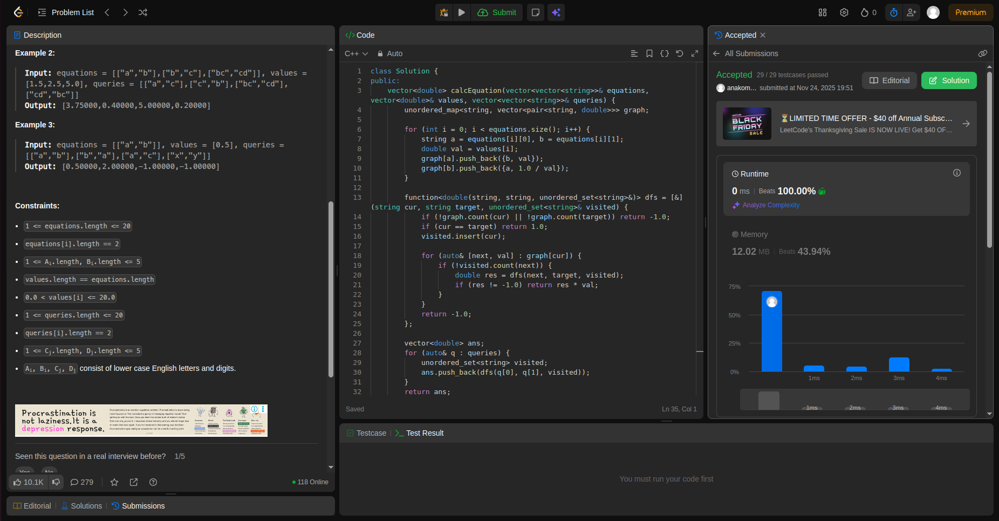

## Alunos  
| Matrícula | Nome |  
|-----------------------|---------------------|  
| 231011079 | Ana Luiza Komatsu Aroeira |  
| xx/xxxxxxx | xxxx xxxx xxxxx |  
## Descrição do projeto
O projeto consiste na resolução de problemas de média e alta complexidade utilizando conceitos de grafos, buscas (DFS e BFS) e lógica de programação aplicada.
Os exercícios abordam a modelagem de estruturas de dados como vértices e arestas, a análise de conexões entre nós e a aplicação de algoritmos clássicos de grafos para resolver desafios de otimização, caminhos e relações entre componentes.

## Problema 1  
**Nível:** Difícil  
**Nome:** Longest Increasing Path in a Matrix  

O exercício busca determinar o **comprimento do caminho estritamente crescente mais longo** dentro de uma matriz `m x n`.  
A partir de qualquer célula, é possível se mover apenas **para cima, para baixo, para a esquerda ou para a direita**, desde que o valor da célula de destino seja **maior** que o valor atual. Movimentos diagonais ou saídas dos limites da matriz não são permitidos.  

A solução utiliza uma abordagem de **busca em profundidade (DFS)** combinada com **programação dinâmica (memoização)**.  
Para cada célula da matriz, realiza-se uma DFS que explora os quatro vizinhos possíveis e calcula o comprimento máximo de caminho crescente a partir dela.  
Os resultados de cada posição são armazenados em uma matriz auxiliar `dp`, evitando recomputações e reduzindo o custo de tempo exponencial para **O(m × n)**.  

Durante o processo, cada célula é visitada no máximo uma vez por caminho crescente, e o valor máximo encontrado entre todas as posições representa o **caminho crescente mais longo da matriz**.  
A técnica de memoização garante eficiência, e o uso de DFS assegura a exploração completa das possibilidades válidas de movimento.  

Essa combinação de **DFS + memoização** é uma aplicação clássica do conceito de **Dynamic Programming on Graphs**, pois o problema pode ser modelado como um grafo direcionado acíclico (DAG), onde cada célula é um nó e as arestas conectam células com valores crescentes.  

## Problema 2 
**Nível:** Difícil  
**Nome:** Reconstruct Itinerary  

O exercício consiste em reconstruir um **itinerário de voos** a partir de uma lista de passagens representadas como pares `(origem, destino)`.  
O objetivo é determinar uma rota válida que utilize **todas as passagens exatamente uma vez**, começando obrigatoriamente pelo aeroporto `"JFK"`.  
Caso existam múltiplas rotas possíveis, deve-se retornar aquela com a **menor ordem lexicográfica** (isto é, a menor em ordem alfabética).  

A solução foi desenvolvida modelando o problema como um **grafo direcionado**, onde:  
- Cada aeroporto representa um **vértice**;  
- Cada passagem representa uma **aresta** entre dois vértices (`origem → destino`).  

Para encontrar o itinerário correto, foi utilizada uma variação do **Algoritmo de Hierholzer**, com o objetivo de construir um **caminho euleriano**, ou seja, um caminho que percorre todas as arestas exatamente uma vez.  
A implementação usa uma **busca em profundidade (DFS)** recursiva para visitar os destinos de cada aeroporto, garantindo a ordem lexicográfica através de uma **fila de prioridade (priority_queue)**.  

Durante a execução, as passagens são removidas à medida que são utilizadas, e o caminho final é reconstruído **em ordem reversa** após o término das chamadas recursivas, resultando no itinerário correto.  

Essa abordagem combina conceitos de **teoria dos grafos, ordenação topológica parcial e DFS**, garantindo uma solução eficiente com complexidade próxima de **O(E log E)**, onde *E* é o número de passagens.

## Problema 3  
**Nível:** Médio  
**Nome:** Evaluate Division  

O problema pede para calcular o resultado de divisões entre variáveis representadas por pares de equações.  
Cada equação tem o formato `A / B = valor`, e é necessário responder várias consultas (`queries`) do tipo `C / D = ?`.  
Caso a relação não possa ser determinada a partir das equações fornecidas, o resultado deve ser `-1.0`.

A ideia central é modelar o conjunto de equações como um **grafo ponderado direcionado**, onde:  
- Cada variável (`a`, `b`, `c`, etc.) é um **nó**;  
- Cada relação `A / B = valor` é uma **aresta** de peso `valor`;  
- A relação inversa `B / A = 1 / valor` também é adicionada ao grafo.  

Para resolver as consultas, é utilizado um algoritmo de **busca em profundidade (DFS)**:  
partindo do nó de origem (`C`), o algoritmo explora todos os caminhos possíveis até o nó de destino (`D`), acumulando o produto dos pesos das arestas percorridas.  
Se o destino for encontrado, o produto acumulado representa o resultado da divisão. Caso contrário, retorna `-1.0`.  

Essa abordagem é eficiente, pois evita recomputações desnecessárias e aproveita a estrutura de grafo para navegar entre variáveis relacionadas.  
Em termos de complexidade, a DFS percorre no máximo todas as equações uma vez, resultando em um custo **O(N + Q)**, onde *N* é o número de equações e *Q* o número de consultas.  

A solução demonstra como aplicar **conceitos de grafos e busca recursiva** em problemas que envolvem relações de proporção e conectividade entre variáveis.

## Problema 4
**Nível:** Médio  
**Nome:** Redundant Connection  

O problema propõe encontrar uma aresta redundante em um **grafo não direcionado**.  
O grafo começa sendo uma **árvore** (ou seja, conectado e sem ciclos), e uma nova aresta é adicionada, criando exatamente um **ciclo**.  
O objetivo é identificar qual aresta pode ser removida para restaurar a estrutura de árvore original.

A solução emprega o algoritmo **Union-Find (Disjoint Set Union - DSU)**, uma estrutura de dados eficiente para detectar ciclos em grafos.  
A ideia central é a seguinte:  
- Inicialmente, cada nó pertence ao seu próprio conjunto;  
- Para cada aresta `(u, v)`, tenta-se unir os conjuntos aos quais pertencem `u` e `v`;  
- Se `u` e `v` já estiverem no mesmo conjunto, significa que adicionar essa aresta criaria um ciclo — logo, ela é **redundante** e deve ser retornada.

O Union-Find é otimizado com **path compression** (compressão de caminho) e **union by rank** (união por altura), garantindo complexidade quase constante por operação, **O(α(n))**, onde α é a função inversa de Ackermann, extremamente pequena na prática.

Essa abordagem é amplamente usada em problemas de detecção de ciclos, árvores geradoras mínimas (como Kruskal) e redes de conexões.

## Referências
https://github.com/edsomjr/TEP